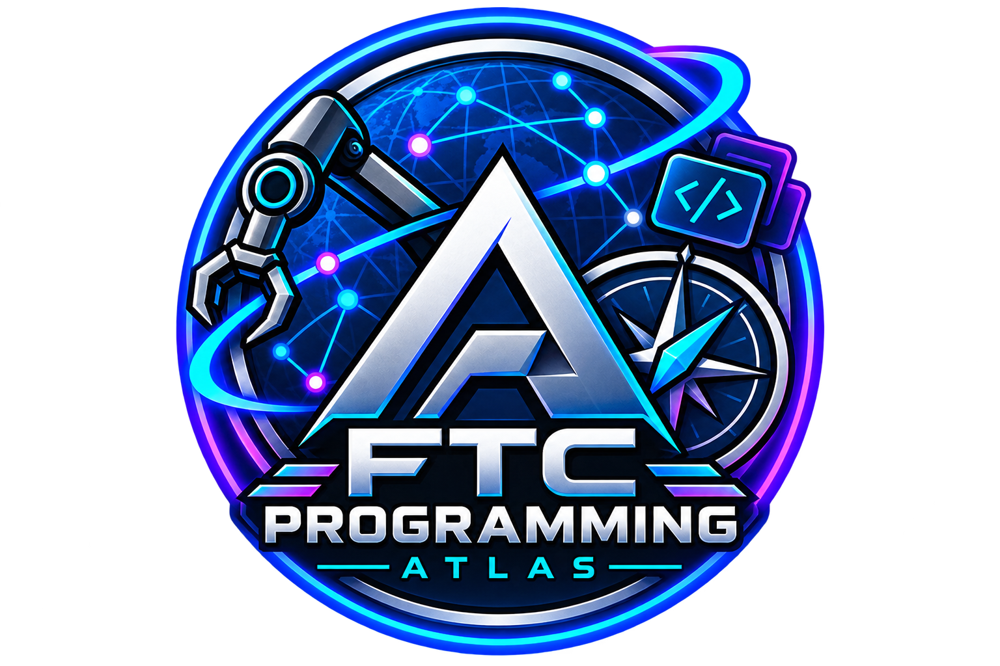

<div align="center">



# FTC Programming Atlas

**An interactive, node-based documentation platform for FTC programming and long-term team knowledge.**

[Live Website](https://ftcprogrammingatlas.com) · [InfotronX #19119](https://itx.infoel.ro)

</div>

---

## Overview

FTC Programming Atlas is a full-stack documentation platform designed to turn FTC programming knowledge into an interactive concept map.

Instead of storing technical knowledge across scattered documents, chat messages, old code, and isolated notes, the Atlas organizes information as connected nodes. Each node can represent a framework, subsystem, programming concept, debugging topic, workflow, or team-specific practice.

Typical topics include:

- FTC SDK
- Pedro Pathing
- Road Runner
- FTCLib
- MeepMeep
- PID / PIDF control
- Localization and odometry
- Vision and OpenCV
- Autonomous architecture
- TeleOp
- Control Hub / Expansion Hub troubleshooting

The goal is not only to document *what* something is, but also to show **how concepts relate to each other**.

---

## Why I Built It

FTC teams accumulate a large amount of technical knowledge over multiple seasons.

The problem is that this knowledge is often fragmented:

- setup instructions remain in old messages
- debugging solutions are remembered by only one programmer
- useful code examples disappear inside old repositories
- new members do not know what to learn first
- framework-specific knowledge becomes difficult to maintain
- important decisions are lost when team members graduate

FTC Programming Atlas was built to solve that problem with a documentation system that is visual, searchable, editable, and designed to survive across team generations.

It is both:

1. a practical knowledge-management tool for **InfotronX #19119**
2. a portfolio project focused on product design, front-end engineering, data architecture, security, UX, and maintainability

---

# Core Features

## Interactive Concept Atlas

- node-based visual documentation map
- labeled relationships between technical concepts
- drag-and-drop positioning
- node resizing
- overlap and collision handling
- zoom, pan, reset view, fit view, and center selection
- desktop and touch navigation
- search across node content and metadata
- filtering by category, difficulty, and tags
- unrelated nodes and edges can be hidden while filtering
- direct URLs for individual nodes

Example deep link:

```text
https://ftcprogrammingatlas.com/node/12/pedropathing
```

Node routes remain stable through the database ID while also keeping a human-readable slug.

---

## Documentation System

Each node can contain much more than plain text.

### Rich-text documentation

The built-in editor supports:

- bold
- italic
- underline
- headings
- blockquotes
- ordered and unordered lists
- links
- multiple font sizes
- formatting cleanup
- sanitized rich HTML rendering

The public viewer renders formatted documentation while protecting the page from unsafe embedded markup.

### Code snippets

Nodes can include multiple code examples with:

- programming language
- title
- explanation
- copy button
- selectable source code
- editor-controlled ordering

Supported examples include:

- Java
- Kotlin
- Python
- C++
- JavaScript
- JSON
- XML
- Bash
- plain text

### Media

Nodes can include:

- screenshots
- diagrams
- JPG / PNG / WEBP / GIF images
- MP4 / WebM / MOV videos
- YouTube content
- external media links
- titles and descriptions
- editor-controlled ordering

### General files and folders

Documentation can also contain downloadable project resources such as:

- PDF
- TXT
- Markdown
- Java / Python source files
- JSON / XML
- configuration files
- ZIP / RAR / 7z archives
- complete folder uploads

Uploaded folder structure is preserved using virtual paths, making it possible to attach small example projects or configuration trees directly to a documentation node.

---

# Reader and Editor Modes

The Atlas separates public reading from content administration.

## Reader Mode

Visitors can:

- explore the map
- search and filter documentation
- open nodes
- follow concept relationships
- view rich-text documentation
- inspect code examples
- view media
- download attached files
- open direct node URLs

No account is required for normal reading.

## Editor Mode

Approved collaborators can additionally:

- create nodes
- edit nodes
- delete nodes
- resize and reposition nodes
- create and edit relationships
- manage taxonomy
- upload media
- upload files and folders
- manage code snippets
- edit the project tutorial
- use Undo / Redo

Authentication uses **Supabase Auth magic links** and editor access is verified server-side against an allowlist.

---

# Editor Interaction Design

The editor contains several interaction patterns designed specifically for working with a large visual map.

### Mouse

- drag a node to reposition it
- resize handles for selected nodes
- single click in Editor Mode selects a node
- double click opens node documentation
- normal Reader Mode keeps single-click opening

### Keyboard movement

Two movement styles are intentionally available:

**Arrow keys**

- slow, precise movement
- useful when nodes are close together

**W / A / S / D**

- accelerated movement
- designed for quickly moving a node across large map distances
- movement stays local until explicitly saved
- prevents excessive database writes

Press:

```text
F
```

to save a pending WASD position.

---

# Dynamic Taxonomy

The Atlas separates three independent classification systems.

### Categories

The main technical area.

Examples:

- FTC SDK
- Pedro Pathing
- Road Runner
- FTCLib
- Vision
- Control Loops

### Difficulties

Learning level or complexity.

Examples:

- Beginner
- Intermediate
- Advanced

### Tags

Reusable labels for more specific concepts.

Examples:

- PID
- Encoder
- IMU
- Feedforward
- Odometry
- VisionProcessor

All three systems can be managed from the **Taxonomy Manager** without modifying source code.

Editors can:

- add items
- rename items
- reorder items
- activate or deactivate items
- delete items
- safely replace a category or difficulty before deletion
- see how many nodes currently use an item

---

# Architecture

```text
                         ┌──────────────────────┐
                         │      Browser         │
                         │ HTML / CSS / JS UI   │
                         └──────────┬───────────┘
                                    │
                                    ▼
                         ┌──────────────────────┐
                         │       Netlify        │
                         │ Static hosting / CDN │
                         │ Edge Functions / SEO │
                         └──────────┬───────────┘
                                    │
                     ┌──────────────┴──────────────┐
                     │                             │
                     ▼                             ▼
          ┌──────────────────────┐      ┌──────────────────────┐
          │   Supabase Data API  │      │   Supabase Storage   │
          │ PostgreSQL + RPC/RLS │      │ Media + node files   │
          └──────────┬───────────┘      └──────────────────────┘
                     │
                     ▼
          ┌──────────────────────┐
          │    Supabase Auth     │
          │ Magic-link editors   │
          └──────────────────────┘
```

The browser is intentionally lightweight while most persistent application state is stored in Supabase.

---

# Data and Backend Design

The project uses PostgreSQL-backed entities for:

- nodes
- edges
- taxonomy categories
- difficulty levels
- tags
- node ↔ tag relationships
- node media
- node files
- code snippets
- project tutorial
- editor allowlist
- Undo history
- Redo history

Mutating operations are protected through a combination of:

- PostgreSQL RPC functions
- Row Level Security
- editor authentication
- server-side permission checks

Public visitors receive read access to documentation while write operations remain restricted.

---

# Security

Security hardening is part of the project architecture rather than an afterthought.

Implemented protections include:

- HTTPS
- HTTP Strict Transport Security
- Content Security Policy
- `X-Content-Type-Options: nosniff`
- clickjacking protection
- Referrer Policy
- Permissions Policy
- restricted external resource origins
- pinned Supabase JavaScript dependency
- Supabase Row Level Security
- editor-only database mutations
- server-side editor verification
- sanitized rich-text content
- restricted authentication workflow
- separate public and editor permissions

The project also includes a public:

[Privacy Policy](https://ftcprogrammingatlas.com/privacy.html)

The site does not intentionally use advertising or marketing tracking cookies.

---

# SEO and Discoverability

FTC Programming Atlas includes a dedicated SEO layer so that the project is discoverable outside the application itself.

Implemented features include:

- descriptive page titles
- meta descriptions
- canonical URLs
- Open Graph metadata
- Twitter / social preview metadata
- `robots.txt`
- XML sitemap
- direct crawlable node links
- human-readable node slugs
- deep-link support
- dynamic node metadata
- Netlify Edge Functions for server-side SEO responses
- dynamic sitemap generation from public Atlas nodes
- Google Search Console integration

Individual documentation nodes can therefore be shared and discovered independently rather than only through the homepage.

---

# Reliability and UX

The application includes handling for:

- loading states
- empty states
- failed requests
- retry flows
- database mutation errors
- unsaved node positions
- browser navigation
- responsive layouts
- mobile viewport changes
- touch gestures
- pinch zoom
- long-press editing
- accidental editor actions

Undo and Redo are synchronized through the backend rather than being limited to a temporary browser-only history.

---

# Tech Stack

## Front End

- HTML5
- CSS
- Vanilla JavaScript
- ES Modules

## Backend

- Supabase
- PostgreSQL
- Supabase Auth
- Supabase Storage
- PostgREST
- PostgreSQL RPC functions
- Row Level Security

## Infrastructure

- GitHub
- Netlify
- Netlify Edge Functions
- Cloudflare DNS
- Google Search Console

---

# Project Structure

```text
FTC-Programming-Atlas/
├── index.html
├── privacy.html
├── README.md
├── _headers
├── _redirects
├── robots.txt
├── sitemap.xml
│
├── img/
│   ├── FTCProgrammingAtlasLogo.png
│   └── FTCProgrammingAtlasFavicon.png
│
├── js/
│   └── atlas-script.js
│
└── netlify/
    └── edge-functions/
        ├── node-seo.js
        └── sitemap.js
```

Database migrations and maintenance SQL are managed separately from the public deployment files.

---

# Running Locally

Clone the repository:

```bash
git clone https://github.com/KiyamaPaD/FTC-Programming-Atlas.git
cd FTC-Programming-Atlas
```

Serve the project with any static HTTP server.

For example:

```bash
python -m http.server 5500
```

Then open:

```text
http://localhost:5500
```

Because the application uses ES Modules, opening `index.html` directly through `file://` is not recommended.

> Editor authentication may require the local URL to be added to the allowed redirect URLs in the Supabase Auth configuration.

---

# Development Principles

Several design choices guide the project.

### Content should not require code changes

Normal documentation maintenance is performed from the application itself.

### Public access should remain simple

Readers should be able to explore documentation without creating an account.

### Editor tools should remain powerful but isolated

Administrative controls appear only when an approved editor is authenticated and Editor Mode is enabled.

### Database writes should be deliberate

For example, accelerated WASD movement is stored locally first and persisted only when the editor explicitly saves the final position.

### The Atlas should survive team turnover

The platform is designed as long-term infrastructure for preserving technical knowledge beyond a single FTC season.

---

# Current Status

FTC Programming Atlas is a functional full-stack application deployed in production.

The platform currently includes:

- interactive node graph
- cloud-synchronized documentation
- dynamic taxonomy
- rich-text editing
- media management
- file and folder attachments
- code snippets
- editor authentication
- server-side permissions
- Undo / Redo
- direct node URLs
- responsive desktop and mobile interactions
- security hardening
- Privacy Policy
- SEO metadata
- dynamic sitemap
- Google indexing support

The main ongoing work is now **content expansion**: documenting more FTC systems, frameworks, debugging knowledge, and team practices.

---

# Roadmap

Potential future improvements include:

- Java and multi-language syntax highlighting
- structured learning paths
- prerequisite relationships
- FTC SDK / framework version compatibility data
- troubleshooting decision trees
- bookmarks
- reader progress tracking
- PWA / offline documentation
- multilingual content
- contribution review workflows
- search analytics and no-result analytics
- traffic analytics
- richer node-level social previews
- automated documentation quality checks

---

# What This Project Demonstrates

FTC Programming Atlas combines multiple areas of software engineering:

- front-end UI engineering
- interaction design
- graph-based information architecture
- JavaScript state management
- asynchronous API integration
- PostgreSQL data modeling
- authentication and authorization
- Row Level Security
- RPC-based mutations
- file and media management
- Undo / Redo architecture
- responsive and touch-friendly UX
- web security hardening
- SEO architecture for a JavaScript application
- server-side edge processing
- product thinking for a real robotics team
- long-term maintainability

---

# Use Cases

The Atlas can be used for:

- onboarding new FTC programmers
- preserving knowledge between competition seasons
- documenting framework-specific setup and tuning
- teaching programming concepts visually
- recording debugging solutions
- documenting team architecture
- sharing reusable code examples
- storing small supporting project files
- building a structured robotics knowledge base

---

# Team

Created for **InfotronX #19119** as a long-term programming documentation and education platform.

# Author

Built by **Cristi** as both a practical FTC team tool and a software engineering portfolio project.

---

<div align="center">

**FTC Programming Atlas**

Preserving programming knowledge, one node at a time.

FTC Programming Atlas is an independent educational project and is not an official product of FIRST®.

</div>
